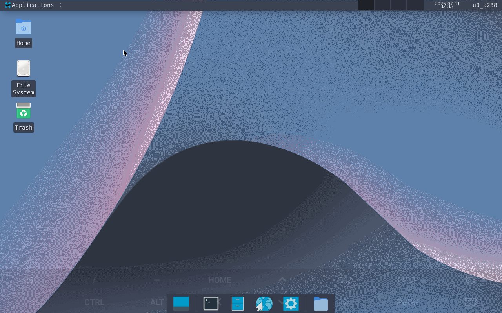
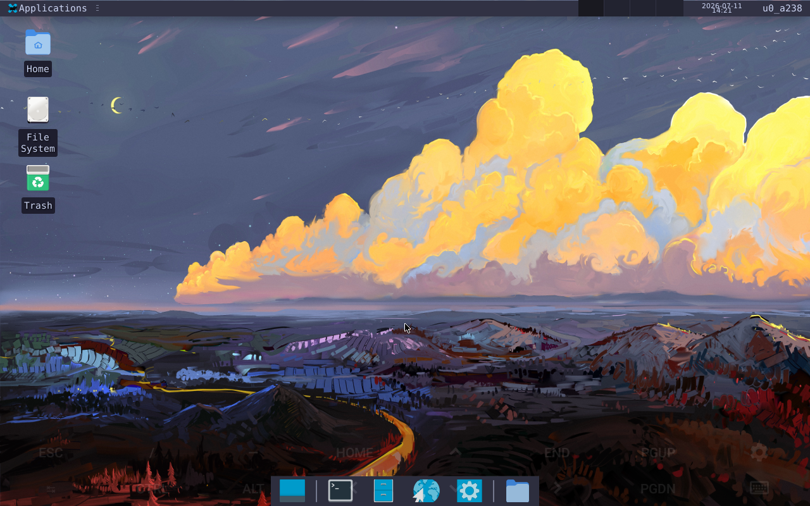
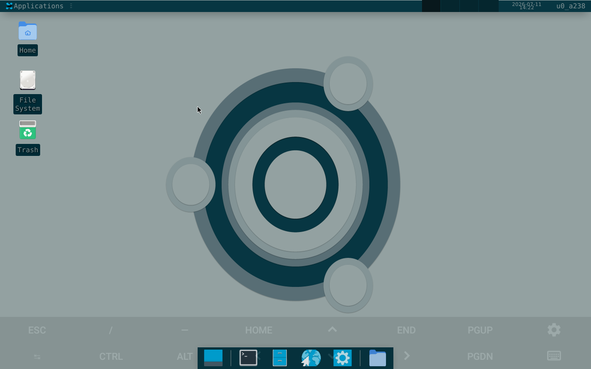
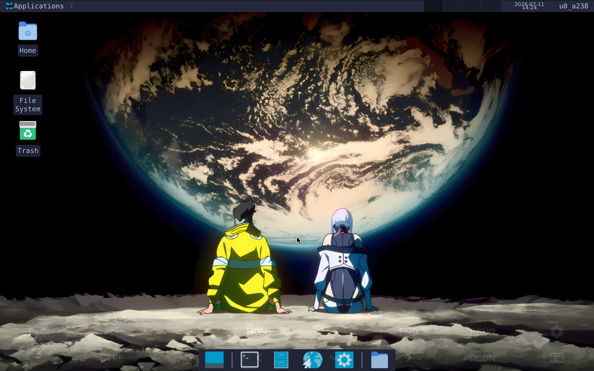
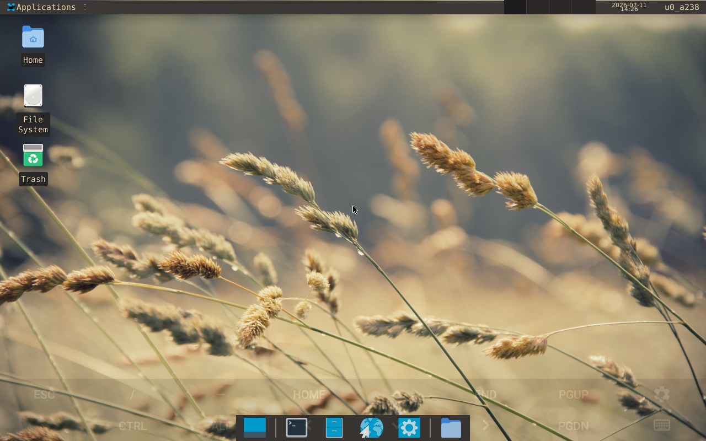
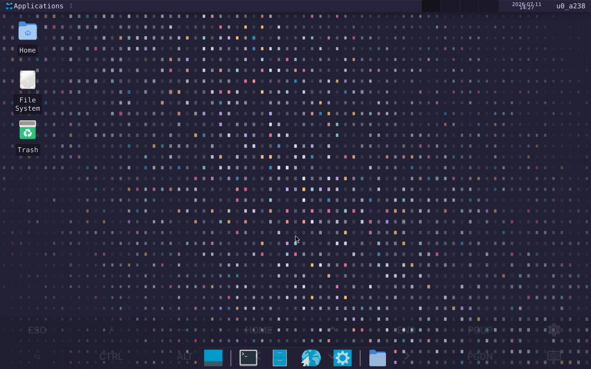

# Termux Desktop

Get a real Linux desktop running on your Android phone, no dual-booting or bootloader nonsense required. Install with one command, then run `startdesktop` whenever you want it.

```
curl -fsSL https://raw.githubusercontent.com/Tanmay-1122/Termux-desktop/main/install.sh | bash
```

The script sets up XFCE4, picks a GPU driver for your device, and drops in a handful of themes and helper scripts along the way.

## Setup

You'll need three apps before running the installer:

- [Termux](https://f-droid.org/packages/com.termux/) — get this from F-Droid or GitHub, **not** the Play Store version, which is outdated and stopped receiving updates a while back
- [Termux:X11](https://github.com/termux/termux-x11/releases) — this is what actually draws the desktop on screen
- [Termux:Widget](https://github.com/termux/termux-widget/releases) — optional, but handy for home screen shortcuts

Once those are installed, open Termux and paste in the install command above. When it finishes, type `startdesktop` and switch over to the Termux:X11 app — your desktop should be sitting there waiting.

## Everyday commands

Once it's installed, most of what you'll want lives behind `startdesktop`:

- `startdesktop` boots the desktop normally
- `startdesktop rdp` if you'd rather connect over Windows Remote Desktop
- `startdesktop novnc` lets you reach it from any browser
- `startdesktop stop` shuts it down cleanly
- `startdesktop --nogpu` skips GPU acceleration, useful if your device is being weird about drivers

A few other scripts get installed alongside it:

- `td-update` — pulls the latest version from GitHub
- `bash ~/theme.sh` — swap between themes
- `bash ~/manage-apps.sh` — install or remove apps from the catalogue
- `bash ~/dashboard.sh` — a quick system health view (CPU, RAM, battery, etc.)

## Home screen widgets

If you grabbed Termux:Widget, long-press your home screen, go to Widgets → Termux:Widget, and drop it somewhere. Resize it so all four shortcuts show:

- Start Desktop
- Manage Apps
- Change Theme
- Check Updates

Tap any of them and it fires off the matching command, no need to open Termux manually.

## Themes

There are eight themes bundled in, each with its own terminal colors, GTK accents, and wallpaper. Interactive picker:

```bash
bash ~/theme.sh
```

<p align="center">
  
  
  
  
  
  
</p>

Or jump straight to one:

```bash
bash ~/theme.sh --auto nord
bash ~/theme.sh --auto catppuccin-mocha
bash ~/theme.sh --auto catppuccin-latte
bash ~/theme.sh --auto solarized-dark
bash ~/theme.sh --auto tokyo-night
bash ~/theme.sh --auto tokyo-night-light
bash ~/theme.sh --auto gruvbox-dark
bash ~/theme.sh --auto rose-pine
```

Nord and Tokyo Night are the two I'd point most people toward if you just want something that looks good out of the box — Catppuccin Latte and Tokyo Night Light are there if you prefer working in a light theme during the day.

## Installing apps

Rather than making you remember exact package names, there's a small curated catalogue:

```bash
bash ~/manage-apps.sh
```

It's grouped into browsers (Firefox, Chromium, Lynx, w3m), editors (Neovim, Micro, Helix, Emacs, Gedit), languages (Python, Node, Ruby, Go, Rust), dev tools (git, tmux, fzf, ripgrep, bat), a few AI coding tools (Claude Code, Aider, Gemini CLI), media stuff (mpv, feh, ffmpeg), and office apps (LibreOffice, Zathura).

## Dashboard

`bash ~/dashboard.sh` gives you a live view of CPU, memory, storage, battery, and network, refreshing every few seconds — nothing fancy, just enough to see what's going on without leaving the terminal.

## GPU acceleration

The installer checks what GPU your phone has and installs the matching driver — Turnip for Qualcomm Adreno chips, VirGL for ARM Mali. If it can't figure out what you've got, it falls back to software rendering. If GPU stuff is causing crashes or glitches, just start with `startdesktop --nogpu` instead.

## Requirements

- Android 8.0 or newer
- At least 3GB RAM
- 3–4GB free storage
- An internet connection for the initial install

## Install presets

The default install is minimal — just the desktop itself. If you want more baked in from the start:

```bash
# desktop + git, curl, Python, Node, htop, micro
PRESET=standard curl -fsSL https://raw.githubusercontent.com/Tanmay-1122/Termux-desktop/main/install.sh | bash

# everything, including Neovim, Ruby, PHP, Rust, tmux, fzf, ripgrep
PRESET=full curl -fsSL https://raw.githubusercontent.com/Tanmay-1122/Termux-desktop/main/install.sh | bash
```

## Project layout

```
install.sh          the installer
start-desktop.sh    launches the desktop
theme.sh            switches themes
manage-apps.sh       app catalogue/installer
dashboard.sh        system monitor
td-update.sh        self-updater
setup.sh            installs dependencies
wallpapers/          wallpaper images for each theme
```

## Updating

```bash
td-update
```

Checks GitHub for a newer release and installs it if one exists.

## Troubleshooting

If the desktop won't start, first double check Termux:X11 is actually installed — it's an easy one to miss. GPU driver issues are the next most common cause, so try `startdesktop --nogpu` before digging further. `bash ~/dashboard.sh` is a decent first stop for figuring out what's wrong in general.

Slow downloads are usually a mirror issue — the installer tries to pick a fast one for your region automatically, but if it's crawling, run `pkg change-repo` and pick a different mirror manually.

If a theme doesn't seem to apply properly, restart the desktop (`startdesktop stop`, then `startdesktop` again) — XFCE doesn't always pick up theme changes live.

## License

GPL-3.0
